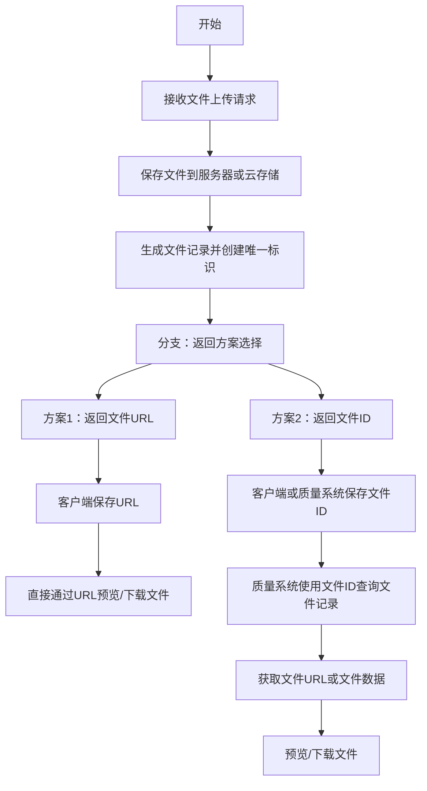
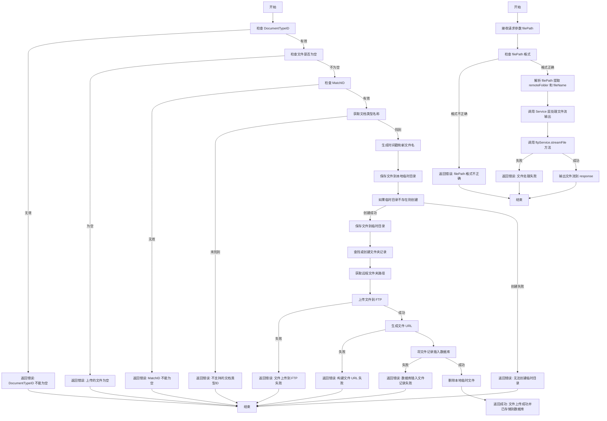

---


# 一、前端文件流下载使用文档

在前端页面（如基于 HTML/JavaScript 的单页应用）中，可以通过 JavaScript（例如 Fetch API）调用该文件下载接口，并使用 Blob 对象生成临时 URL，以触发浏览器下载或在线预览。

## 示例代码（使用 Fetch API 触发文件下载）


```javascript
/**
 * 下载文件函数
 * @param {String} filePath - 文件在 FTP 上的相对路径，如 "uploads/Manual/xxx.png"
 */
function downloadFile(filePath) {
    // 拼接接口地址，注意对 filePath 进行 URL 编码
    const url = `http://localhost:8088/fms/ftp/download?filePath=${encodeURIComponent(filePath)}`;

    fetch(url, {
        method: 'GET',
        // 如果接口需要认证，可在 headers 添加认证信息
        // headers: { 'Authorization': 'Bearer <token>' }
    })
    .then(response => {
        if (!response.ok) {
            throw new Error('文件下载失败，状态码：' + response.status);
        }
        // 将响应体转换为 Blob 对象
        return response.blob();
    })
    .then(blob => {
        // 创建一个临时 URL 表示该 Blob 对象
        const downloadUrl = window.URL.createObjectURL(blob);
        
        // 创建一个隐藏的 <a> 标签，并设置 href 为 Blob URL，同时设置下载文件名
        const a = document.createElement('a');
        a.style.display = 'none';
        a.href = downloadUrl;
        
        // 提取文件名（从 filePath 获取，如果需要更复杂处理可自行处理）
        const fileName = filePath.substring(filePath.lastIndexOf('/') + 1);
        a.download = fileName;
        
        // 将 <a> 标签添加到页面，点击后触发下载
        document.body.appendChild(a);
        a.click();
        
        // 清理临时 URL 和元素
        window.URL.revokeObjectURL(downloadUrl);
        document.body.removeChild(a);
    })
    .catch(error => {
        console.error('下载文件失败:', error);
        alert('下载文件失败: ' + error.message);
    });
}

// 使用示例：点击按钮调用 downloadFile 函数
document.getElementById('downloadBtn').addEventListener('click', function() {
    // 替换为实际的文件相对路径
    const filePath = 'uploads/Manual/2RKQmbnFar92fsLbWXEUty_20250121101452.png';
    downloadFile(filePath);
});
```

## HTML 示例页面

```html
<!DOCTYPE html>
<html lang="zh-CN">
<head>
    <meta charset="UTF-8">
    <title>文件下载示例</title>
</head>
<body>
    <h2>文件下载示例</h2>
    <button id="downloadBtn">下载文件</button>
    <script>
        // 将上面的 downloadFile 函数代码粘贴到这里
        function downloadFile(filePath) {
            const url = `http://localhost:8088/fms/ftp/download?filePath=${encodeURIComponent(filePath)}`;
            fetch(url, {
                method: 'GET'
            })
            .then(response => {
                if (!response.ok) {
                    throw new Error('文件下载失败，状态码：' + response.status);
                }
                return response.blob();
            })
            .then(blob => {
                const downloadUrl = window.URL.createObjectURL(blob);
                const a = document.createElement('a');
                a.style.display = 'none';
                a.href = downloadUrl;
                const fileName = filePath.substring(filePath.lastIndexOf('/') + 1);
                a.download = fileName;
                document.body.appendChild(a);
                a.click();
                window.URL.revokeObjectURL(downloadUrl);
                document.body.removeChild(a);
            })
            .catch(error => {
                console.error('下载文件失败:', error);
                alert('下载文件失败: ' + error.message);
            });
        }

        document.getElementById('downloadBtn').addEventListener('click', function() {
            const filePath = 'uploads/Manual/2RKQmbnFar92fsLbWXEUty_20250121101452.png';
            downloadFile(filePath);
        });
    </script>
</body>
</html>
```

## 说明

- **文件流返回方式**：后端接口通过读取 FTP 上的文件并将内容写入 HttpServletResponse 的 OutputStream，返回的数据即为文件流。前端通过 fetch 获取二进制数据（Blob）后生成临时 URL，进而通过 `<a>` 标签触发下载动作。
- **兼容性**：以上方法适用于大部分现代浏览器。若需要兼容老版本 IE，可以考虑使用其他下载方案（例如使用 iframe 等方法）。
- **错误处理**：前端代码中增加了错误处理逻辑，提示用户下载异常信息。

---

下面在前面文件流下载方案的基础上，补充一个在线预览文件的功能说明和示例。在线预览与下载的主要区别在于 HTTP 响应头的设置，在线预览会采用 `Content-Disposition:inline`（或者不设置下载附件），同时根据文件类型设置正确的 `Content-Type`，使浏览器直接解析并显示文件（如图片、PDF、文本等）。

---

## 一、后端在线预览接口

### 接口示例代码

假设你扩展了原来的 `/download` 接口，新增一个在线预览接口（例如 `/preview`），其代码示例如下：

```java
@Anonymous
@GetMapping("/preview")
public void previewFile(@RequestParam("filePath") String filePath,
                        HttpServletResponse response) {
    try {
        // 1. 解析 filePath，分离出文件夹和文件名
        int lastSlashIndex = filePath.lastIndexOf('/');
        if (lastSlashIndex < 0) {
            response.setStatus(HttpServletResponse.SC_BAD_REQUEST);
            response.getWriter().write("filePath 格式不正确");
            return;
        }
        String remoteFolder = filePath.substring(0, lastSlashIndex);
        String fileName = filePath.substring(lastSlashIndex + 1);

        // 2. 本地暂存路径（可以使用临时目录）
        String localFilePath = ftpService.getTempDir() + fileName;

        // 3. 下载文件到本地（与下载接口类似）
        boolean success = ftpService.downloadFile(remoteFolder, fileName, localFilePath);
        if (!success) {
            response.setStatus(HttpServletResponse.SC_NOT_FOUND);
            response.getWriter().write("文件下载失败或不存在");
            return;
        }

        // 4. 根据文件类型设置 Content-Type
        // 例如，这里简单根据文件扩展名决定，实际可使用更完善的方式。
        String contentType = "application/octet-stream";
        if (fileName.endsWith(".png")) {
            contentType = "image/png";
        } else if (fileName.endsWith(".jpg") || fileName.endsWith(".jpeg")) {
            contentType = "image/jpeg";
        } else if (fileName.endsWith(".gif")) {
            contentType = "image/gif";
        } else if (fileName.endsWith(".pdf")) {
            contentType = "application/pdf";
        } else if (fileName.endsWith(".txt")) {
            contentType = "text/plain";
        }
        response.setContentType(contentType);

        // 5. 设置响应头，采用 inline 使浏览器直接显示，不弹出下载对话框
        response.setHeader("Content-Disposition", "inline; filename=" + URLEncoder.encode(fileName, "UTF-8"));

        // 6. 将本地文件流写入 HTTP 响应
        try (InputStream inputStream = new FileInputStream(localFilePath);
             OutputStream outputStream = response.getOutputStream()) {
            byte[] buffer = new byte[8192];
            int bytesRead;
            while ((bytesRead = inputStream.read(buffer)) != -1) {
                outputStream.write(buffer, 0, bytesRead);
            }
        }

        // 7. 删除本地临时文件（根据实际情况选择是否删除）
        new File(localFilePath).delete();
    } catch (Exception e) {
        try {
            response.setStatus(HttpServletResponse.SC_INTERNAL_SERVER_ERROR);
            response.getWriter().write("预览出现异常: " + e.getMessage());
        } catch (IOException ex) {
            log.error("无法返回异常信息到客户端", ex);
        }
    }
}
```

### 说明

- **接口 URL：**  
  `GET http://localhost:8088/fms/ftp/preview?filePath=uploads/Manual/xxx.png`

- **请求参数：**
    - `filePath`：文件在 FTP 上的相对路径，如 `uploads/Manual/xxx.png`。

- **核心区别：**
    - 设置 `Content-Disposition:inline`，浏览器便会尝试在窗口内直接显示文件（例如图片或 PDF）。
    - 根据文件后缀，设置合适的 `Content-Type`，方便浏览器正确解析文件格式。

---

## 二、Postman 在线预览接口文档

### 接口说明

该接口用于在线预览文件。
- **URL：**
  ```
  GET http://localhost:8088/fms/ftp/preview
  ```

- **请求参数（Query 参数）：**
    - `filePath` (string, 必传)：例如 `uploads/Manual/xxx.png`

- **请求示例：**
  ```
  GET http://localhost:8088/fms/ftp/preview?filePath=uploads/Manual/xxx.png
  ```

- **响应说明：**
    - 如果文件类型（如图片、PDF）浏览器支持直接显示，则会直接在 Postman 的预览窗口中显示（需要 Postman 的预览模式）；否则返回的就是原始文件流数据，用户可点击“Save Response”保存。

- **错误示例：**
  ```json
  {
    "msg": "文件下载失败或不存在",
    "code": 404
  }
  ```

---

## 三、前端在线预览使用文档

前端可以采用 `<iframe>`、`` 或 `<object>` 标签来嵌入预览页面，并直接访问该接口实现在线预览。

### 示例 1：基于 `<iframe>` 显示 PDF 或图片

```html
<!DOCTYPE html>
<html lang="zh">
<head>
    <meta charset="UTF-8">
    <title>文件在线预览示例</title>
    <style>
        iframe { width: 100%; height: 600px; border: none; }
    </style>
</head>
<body>
    <h2>在线预览文件</h2>
    <!-- 通过 iframe 直接加载预览接口 -->
    <iframe id="previewFrame" src=""></iframe>

    <script>
        function loadPreview(filePath) {
            // 拼接预览接口地址（记得编码 filePath 参数）
            const previewUrl = `http://localhost:8088/fms/ftp/preview?filePath=${encodeURIComponent(filePath)}`;
            document.getElementById('previewFrame').src = previewUrl;
        }

        // 示例：加载一个图片或 PDF 文件的在线预览
        loadPreview('uploads/Manual/xxx.png');
    </script>
</body>
</html>
```

### 示例 2：基于 JavaScript 动态加载预览（图片展示）

如果文件是图片，也可以直接使用 `` 标签来展示在线预览效果。

```html
<!DOCTYPE html>
<html lang="zh">
<head>
    <meta charset="UTF-8">
    <title>图片在线预览示例</title>
</head>
<body>
    <h2>在线预览图片</h2>
    

    <script>
        function loadImagePreview(filePath) {
            // 拼接预览接口地址
            const previewUrl = `http://localhost:8088/fms/ftp/preview?filePath=${encodeURIComponent(filePath)}`;
            document.getElementById('previewImg').src = previewUrl;
        }

        // 示例：加载图片在线预览
        loadImagePreview('uploads/Manual/xxx.png');
    </script>
</body>
</html>
```

### 说明

- **核心思路：**  
  前端页面通过直接引用预览接口的 URL，使得浏览器加载后端返回的文件流并根据 Content-Type 进行解析，从而实现在线预览。
- **注意事项：**
    - 当预览的内容为 PDF 或其他支持内嵌显示的文件时，推荐使用 `<iframe>` 或 `<object>` 标签；
    - 如果文件为图片，则 `` 标签即可；
    - 如果需要更复杂的预览效果（例如在线编辑、旋转、缩放等），可以结合第三方预览插件。

---
